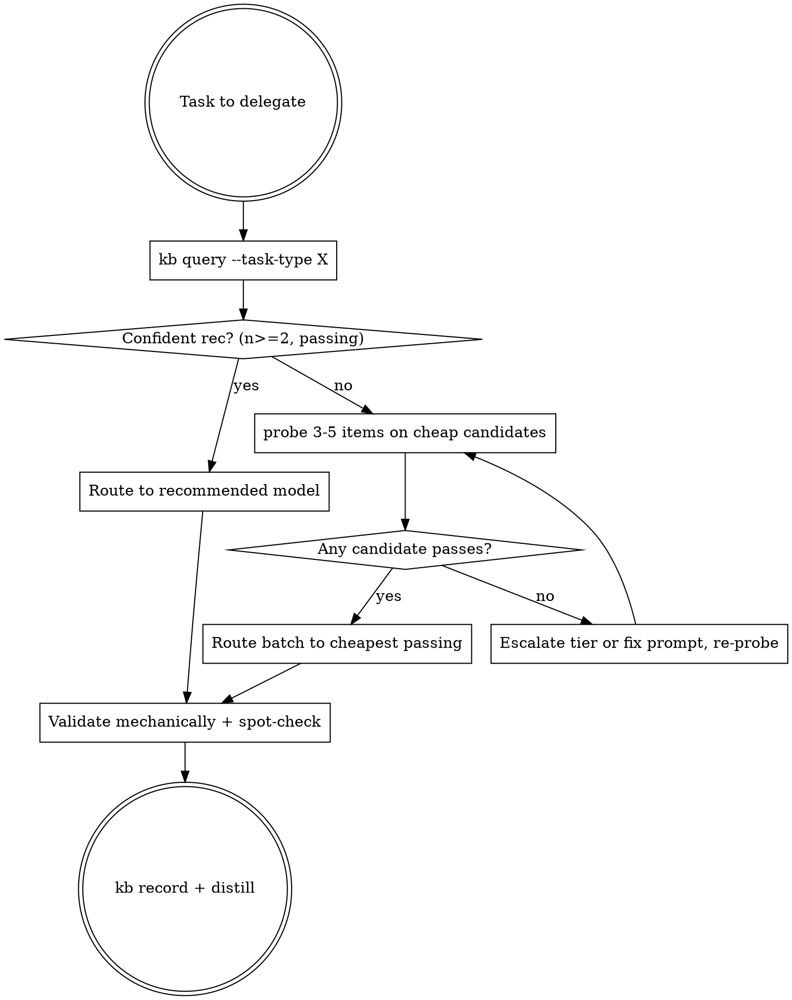

# Right-Sizing Model Selection

## Overview

Route every task to the cheapest model that meets the quality bar — decided by **recorded evidence, not vibes**. The strong model analyzes and orchestrates; cheaper models execute. You already know haiku handles simple tasks; what you systematically get wrong is everything that needs *memory*: which local model actually passed translation last month, what prompt style made it pass, and how much verification that evidence still requires.

**Core rule: never assert a model is too weak (or good enough) for a task type without a KB record or a probe result. "Uncalibrated" means probe it, not exclude it.**

Measured counter-examples to routing by intuition (2026-06): hand-written difficulty priors were wrong on **10 of 16** benchmark tasks — 9 paid for capability the task didn't need, 1 sent a task to models that fail it (proofreading: small local models *overcorrect*; haiku 9.0 vs gpt-oss 3.0). In the first probe, local `openai/gpt-oss-20b` beat Haiku on translation (9.7 vs 9.3, ~5× faster, $0); in calibration, haiku 9.0 beat opus 6.0 on a grounded-analysis task where opus invented a fact (n=1, different judges — directional, not settled).

## When to use

- Delegating to subagents (`model:` option), `claude -p`, LM Studio, or OpenRouter (`or:` ids)
- Batches: N similar items where per-item cost × N matters
- Any "which model should do this?" moment, including inside plans

**When NOT to delegate at all:** one-off tasks on content you have *already read* (re-reading costs more than doing), tasks needing your full conversation state, or N so small that dispatch overhead exceeds the work (see Economics).

**Doing it yourself is also a model selection.** Reading a 400-item file into your own context to process it routes the batch to the most expensive model in the building — that choice needs the same KB/probe evidence as any other. The "already in context" exemption covers content you've read for other reasons; it is not a license to ingest batches.

## The procedure



Difficulty calibration for the first guess (probe confirms): trivial/mechanical (classify, extract with schema) → local or haiku; templated transforms (translate, summarize, simple codegen) → local/haiku, sonnet if nuanced; synthesis, creative quality, multi-step reasoning → sonnet/opus; subtle correctness (concurrency review, security, architectural judgment) → default opus/fable, downgradable only on probe/KB evidence for the specific shape (short contained snippets measured fine on cheap tiers; 800-line modules did not) — cost pressure alone never downgrades these: a confident false negative looks identical to a clean bill of health. Beware look-trivial restraint tasks: proofreading inverted the ladder entirely (small models overcorrect; haiku 9.0 vs gpt-oss 3.0).

**Evidence hierarchy** (use the strongest available; never route a batch on the bottom rungs alone):

```
local KB record (n>=2) > fresh probe > family-transfer from KB > benchmark prior > provenance/load-state
```

When the KB has nothing for a task type, order probe candidates with `kb prior --task-type X` — public benchmark rankings (SWE-bench, LiveCodeBench, MMLU-Pro, LMArena, …) mapped to our inventory, with per-benchmark validity notes in `references/benchmarks.md`. Family transfer counts too: a sibling model's KB record (same family/size class) is a stronger prior than any leaderboard. **Divergence detector:** a model scoring far below its public benchmark profile locally means a broken integration (chat template, max_tokens eaten by reasoning, params) — fix the path before writing off the model; GLM-4.7-Flash benches SWE 59 publicly and scored 0.0 here because of a template leak.

## Scripts (in `scripts/`)

| Script | Job | Typical call |
|---|---|---|
| `llm` | Dispatch to any model, one interface | `echo "$P" \| scripts/llm -m haiku --json`; `-m or:z-ai/glm-4.7-flash` for OpenRouter (explicit `or:` prefix = paid opt-in, real cost in the envelope); `scripts/llm --list` shows local models + load state |
| `probe` | Empirical fit test: candidates × sample items, judged, ranked | `scripts/probe --task-type translation --task "..." --criteria "..." --models openai/gpt-oss-20b,haiku --items-file s.txt --record` |
| `kb` | Persistent calibration: record/query/prior/distill | `scripts/kb query --task-type extraction`; `scripts/kb record --task-type extraction --model haiku --quality 8.5 --prompt-notes "strict schema + example"`; `scripts/kb prior --task-type codegen-complex` (benchmark-derived ordering when KB is empty); `scripts/kb distill` |

Run `--help` on each for full flags. Do not write ad-hoc dispatch scripts — extend these.
Quality is 0–10 (judged against acceptance criteria), not pass/fail. Task types are the canonical set from `kb types` — inventing variants (`sentiment-classification` for `classification`) fragments the KB and was observed in testing.

## Probing protocol

- 3–5 **representative** items, deliberately including the hardest (longest, noisiest, most placeholders).
- Criteria must name **hard constraints** (placeholders byte-identical, valid JSON, compiles) — the judge caps violations at 4/10.
- Judge with `sonnet` (default). Never hand-judge as orchestrator unless adjudicating disagreements — that's where your tokens have leverage.
- `--record` always: a probe that isn't recorded is money burned twice.

## Prompt adaptation per tier

What you'd tell sonnet is not what you send down-ladder. Weaker model ⇒ stricter prompt:

| Tier | Add to the prompt |
|---|---|
| sonnet | Clear instruction + output format |
| haiku | + exact schema, decision rules for edge cases, "output nothing but X" |
| local | + one worked example (anchors format), simpler sentences, no implicit context, low temperature; re-state constraints at the end |

Record what worked via `kb record --prompt-notes` — prompt style is part of the fit. Per-model quirks: `references/models.md`.

## Verification proportional to evidence

| Evidence for the model on this task type | Verification |
|---|---|
| KB: n≥5 passing | Mechanical validators (row counts, schema, regex) + spot-check ~5% |
| KB: n=2–4 passing, or fresh probe pass | Mechanical validators on 100% + spot-check ~10% |
| None (don't do this) | — probe first |

A second full pass on another model is for high-stakes output only — name the stake before paying double. Mechanical validation is free; write the validator before the batch runs.

## Economics (measured 2026-06)

- `claude -p` carries ~9–27K input tokens of fixed overhead **per invocation** (system prompt; varies with cache state — measured ≈$0.013 haiku for a one-word reply). **Batch 20–50 items per call**; never one item per call.
- Subagents (Agent tool) carry similar per-spawn overhead — fan out for parallelism or isolation, not for tiny items.
- LM Studio: $0, ~1–15s/item, but check `llm --list` — `not loaded` models JIT-load (slow) or fail memory guardrails (a 27B+ model may need >40GB). Prefer loaded models; one model loads at a time.
- OpenRouter (`or:` ids): per-token market prices, **no fixed dispatch overhead** (direct HTTP), no memory constraints, parallel calls fine (no one-model-at-a-time limit). The price band between free-local and haiku is densely populated (curated shortlist with prices: `references/openrouter-models.json`); `kb`/`probe` rank `or:` models by real blended $/MTok. Three patterns where it wins: a **hosted twin** of a locally broken or unloadable model (glm-4.7-flash: 0.0 local, flawless hosted at $0.06/$0.4); **scale-out** past LM Studio's serial constraint; **1M-context** models for inputs no local model holds.
- **Privacy is a routing criterion**: LM Studio keeps data on the machine; `or:` sends it to third-party providers, and `:free` variants are typically free *because* prompts may be used for training (account data-policy settings can block them — observed as HTTP 404 "guardrail restrictions"). Sensitive data routes local or Claude, not to the cheapest endpoint.

## Rationalizations (all observed in baseline testing)

| Excuse | Reality |
|---|---|
| "Local model quality is uncalibrated, exclude it" | Probing takes 2 minutes. gpt-oss-20b beat haiku on translation. Calibrate, then decide. |
| "I'll hand-label a gold set myself" | You're the most expensive model in the building. Sonnet judges; you adjudicate disagreements. |
| "Dual full pass for accuracy" | Verification proportional to evidence. Mechanical validators first — they're free. |
| "No data on this, I'll just use haiku/sonnet to be safe" | That guess unrecorded is the same guess next month. Probe once, record, stop guessing. |
| "I'll write a quick dispatch script" | `scripts/llm` exists. Reinvented plumbing is how results stop being comparable. |
| "Probing is overhead, the batch is only $3" | The KB record outlives this batch. You're buying calibration for every future session. |
| "Cost mandate says minimize spend, so haiku reviews the concurrency code" | Underkill on subtle-correctness work produces confident false negatives. The mandate is satisfied by right-sizing the other 90%. |
| "Accuracy matters and it's only ~10K tokens — I'll classify them myself in-context" | You just routed the batch to the priciest model with zero evidence it's needed. Calibrated cheap models score 10/10 on this task type; your accuracy leverage is the spot-check and adjudication, not the bulk pass. |
| "I'll invoke the skill, expected outcome: my current plan" | Deciding first and consulting second is not consulting. Run `kb query` before forming the plan, not after. |
| "It tops SWE-bench, skip the probe" | Benchmarks rank general strength on someone else's distribution, harness, and build. ~80% of benchmark variance is one general factor; your task's specific failure mode (restraint, schema discipline, format) is exactly what they miss. The prior orders the probe — it never replaces it. |
| "It benches low, scored 0 locally — the model is weak" | A local score far below the public profile means a broken path (chat template, max_tokens vs reasoning, params), not a weak model. Fix the integration, re-probe. |

## Red flags — stop and run the procedure

- About to delegate without having run `kb query`
- About to type a model name into a plan with no evidence attached
- About to bulk-read a file of N items into your own context to process them yourself
- About to exclude local models with the word "uncalibrated"
- About to run a full second-model pass "to be safe"
- Finished a delegation and about to move on without `kb record`
